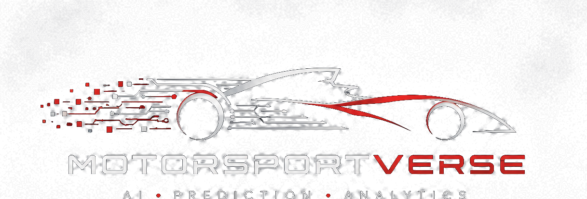

<div align="center">



**A unified, open-source motorsport AI ecosystem.**

One repository. One catalog. Many sport-specific prediction projects on shared ML & data infrastructure.

[Live site](https://roni-altshuler.github.io/motorsportverse/) ·
[Project catalog](https://roni-altshuler.github.io/motorsportverse/#projects) ·
[Architecture](docs/architecture.md) ·
[Adding a sport](docs/adding-a-sport.md) ·
[Governance](GOVERNANCE.md)

</div>

---

## Vision

MotorsportVerse is a single home for predicting motorsport outcomes with AI and
machine learning. The goal is one coherent "universe" of projects — Formula 1,
Formula 2, and every series after them — that all forecast race results, then
grade themselves against reality, instead of a scatter of disconnected
repositories.

It is to motorsport prediction what [scverse](https://scverse.org/) is to
single-cell biology: a discoverable hub of independent, repo-ready projects that
all build on a common foundation. Every series gets its own project and its own
dashboard, but they share the numerically heavy parts — calibration, championship
simulation, evaluation, drift detection, model promotion, and a canonical data
schema — so a new sport is a thin layer on a proven core, not a rewrite.

**Principles**

- **One repository, one catalog.** Every project lives here and is listed in a
  machine-readable [registry](registry/). The catalog is the source of truth for
  which sports exist and how mature each one is.
- **Shared core, thin projects.** Reusable ML & data infrastructure lives in two
  pip packages; each sport supplies only a data source and a predictor.
- **Honest by construction.** Probabilities are calibrated and gated — a project
  never claims more confidence than its data supports — and every prediction is
  scored against the real result.
- **Each series is first-class.** Open-wheel, stock car, endurance, rally, and
  formula-electric all belong; none is an afterthought.

## What's here

```
motorsportverse/
├── website/                 ecosystem landing site + project catalog (Next.js, static export)
├── packages/
│   ├── motorsport-core      shared ML & evaluation infrastructure (pip)
│   └── motorsport-data      canonical schema + ingestion + history store (pip)
├── projects/
│   ├── f1-predictions       RaceIQ F1 — the flagship & reference implementation
│   ├── f2-predictions       RaceIQ F2 — first sport on the shared core
│   ├── f3-predictions       RaceIQ F3 — the golden-template new-series clone
│   ├── formula-e-predictions RaceIQ Formula E — live product (pulselive API)
│   ├── nascar-predictions   RaceIQ NASCAR — live product (DNF hazard, Chase title MC)
│   ├── indycar-predictions  RaceIQ Indy — live product (curated history, dual-surface form)
│   └── <5 more>             scaffolded series (WEC, MotoGP, WRC, IMSA, Le Mans)
│                            — DataSource+Predictor seams ready to implement
├── registry/                the project catalog (JSON + schema; source of truth)
├── docs/                    unified documentation
├── scripts/                 registry builder + new-project scaffolder
└── templates/               project skeleton
```

> The **F1 flagship** previously lived in its own repository and has been merged
> in here, with full git history, under [`projects/f1-predictions/`](projects/f1-predictions/).
> Its prediction pipeline, race-weekend automation, and dashboard now run from
> this monorepo.

## Project catalog

Every project is a **RaceIQ** product built on the shared core; the ecosystem hub
is **MotorsportVerse**.

| Project | Sport | Maturity |
|---|---|---|
| [RaceIQ F1](projects/f1-predictions/) | Formula 1 | **production** |
| [RaceIQ F2](projects/f2-predictions/) | Formula 2 | **production** |
| [RaceIQ F3](projects/f3-predictions/) | Formula 3 | **experimental** (real 2026 season; accuracy accruing) |
| [RaceIQ Formula E](projects/formula-e-predictions/) | Formula E | **experimental** (site live; accuracy accruing) |
| [RaceIQ NASCAR](projects/nascar-predictions/) | NASCAR Cup | **experimental** (site live; accuracy accruing) |
| [RaceIQ Indy](projects/indycar-predictions/) | IndyCar | **experimental** (site live; accuracy accruing) |
| [WEC](projects/wec-predictions/) · [MotoGP](projects/motogp-predictions/) · [WRC](projects/wrc-predictions/) · [IMSA](projects/imsa-predictions/) · [Le Mans](projects/lemans-predictions/) | — | in-development (scaffolded) |

Browse them all on the [live catalog](https://roni-altshuler.github.io/motorsportverse/#projects)
or under the website's `/projects` directory. See the
[branding system](docs/BRANDING_SYSTEM.md) for the per-series identity.

## Deployment

GitHub Pages serves one site per repository, so the whole ecosystem ships as a
single artifact:

| Site | URL |
|---|---|
| Ecosystem hub | https://roni-altshuler.github.io/motorsportverse/ |
| RaceIQ F1 dashboard | https://roni-altshuler.github.io/motorsportverse/projects/f1/ |
| RaceIQ F2 dashboard | https://roni-altshuler.github.io/motorsportverse/projects/f2/ |
| RaceIQ F3 dashboard | https://roni-altshuler.github.io/motorsportverse/projects/f3/ |
| RaceIQ Formula E dashboard | https://roni-altshuler.github.io/motorsportverse/projects/formula-e/ |
| RaceIQ NASCAR dashboard | https://roni-altshuler.github.io/motorsportverse/projects/nascar/ |
| RaceIQ Indy dashboard | https://roni-altshuler.github.io/motorsportverse/projects/indycar/ |

## Quick start

```bash
# Shared packages (editable installs)
pip install -e "packages/motorsport-core[dev]" "packages/motorsport-data[dev]"
pytest packages/motorsport-core packages/motorsport-data

# Build/validate the catalog
python scripts/build_registry.py

# Run the ecosystem website
cd website && npm install && npm run dev   # → http://localhost:3000

# Run a project (the F1 flagship)
cd projects/f1-predictions/website && npm install && npm run dev

# Scaffold a new sport (use --skip-registry if the catalog entry already exists)
python scripts/new_project.py <slug>-predictions --sport "<Sport>" \
  --category <category> --summary "<one-line blurb>" --added <ISO date>
```

## How a series gets promoted

Every sport moves through the same honest ladder: **scaffolded** (project tree +
core seams) → **experimental** (runs end-to-end on real data, accuracy accruing)
→ **production** (forward accuracy validated over real rounds). F2 proved the
template; F3 followed it in a fraction of the time — the FIA feeder-series
scraper, the spec-series skill model, and the entire probability/championship
stack were reused outright. Formula E, NASCAR and IndyCar each cloned that
recipe onto a very different data reality (a live API, an unofficial JSON
feed, and a hand-verified committed archive). The five scaffolded series are
ready for the same path the moment a data feed is wired.

## Documentation

[Architecture](docs/architecture.md) · [Adding a sport](docs/adding-a-sport.md) ·
[Core API](docs/core-api.md) · [Data schema](docs/data-schema.md) ·
[Design system](docs/design-system.md) · [Branding system](docs/BRANDING_SYSTEM.md) ·
[Governance](GOVERNANCE.md) · [Org structure](.github/ORG_STRUCTURE.md)

## License

MIT — see [LICENSE](LICENSE).
