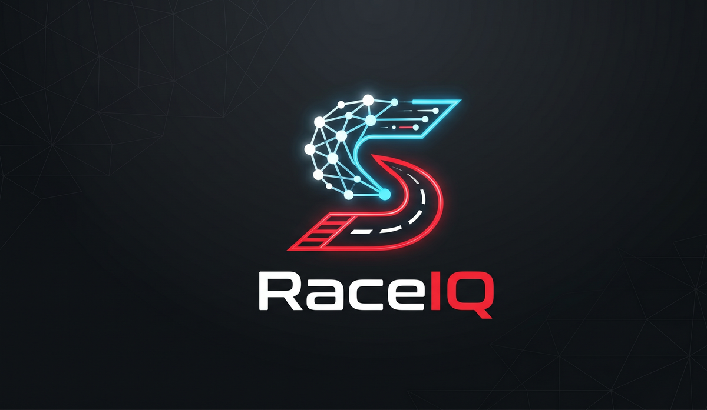

<div align="center">



# RaceIQ

**A self-evaluating Formula 1 prediction platform.**
RaceIQ forecasts every Grand Prix weekend, then scores itself against the real
results — round after round — and ships the whole thing as a polished,
interactive dashboard.

[**Live demo**](https://roni-altshuler.github.io/f1_predictions/) ·
[Accuracy dashboard](https://roni-altshuler.github.io/f1_predictions/accuracy/) ·
[Architecture](docs/ARCHITECTURE.md) ·
[Contributing](CONTRIBUTING.md)

[](https://github.com/roni-altshuler/f1_predictions/actions/workflows/ci.yml)
&nbsp;[](https://github.com/roni-altshuler/f1_predictions/actions/workflows/deploy.yml)
&nbsp;
&nbsp;
&nbsp;
&nbsp;[](LICENSE)

</div>

---

## What it does

- **Predicts every weekend** of the 2026 season — qualifying pace, finishing
  order, and win/podium probabilities, each with a confidence band.
- **Honest, calibrated probabilities** — predictions are gated: raw numbers ship
  until enough multi-season history exists to calibrate, at which point the
  dashboard flips to calibrated output and shows a "Calibrated" badge. RaceIQ
  never claims more confidence than the data supports.
- **Grades its own homework** — every prediction is scored after the race
  against a "last-race-winner" baseline. Round-by-round accuracy lives on the
  [accuracy dashboard](https://roni-altshuler.github.io/f1_predictions/accuracy/)
  and feeds an automated drift report and model-promotion gate.
- **Driver-first UI** — results tables, standings, podiums, and championship
  lanes are built around driver headshots rather than 3-letter codes.
- **Sprint weekends are first-class** — Sprint Qualifying + Sprint Race sit
  alongside Qualifying and the Grand Prix on each race page.
- **Championship math** — "who can still win the title" lanes with
  mathematical-elimination logic, plus living points-progression projections for
  both the drivers' and constructors' championships.

## Explore the live dashboard

The deployed site is the best way to see RaceIQ in action — every page is live
and updates automatically within minutes of each session:

| Page | What you'll see |
|---|---|
| [Home](https://roni-altshuler.github.io/f1_predictions/) | Next-Grand-Prix predicted podium + season pulse |
| [Race detail](https://roni-altshuler.github.io/f1_predictions/race/7/) | Per-weekend sessions, model forecast, circuit & strategy deep-dive |
| [Standings](https://roni-altshuler.github.io/f1_predictions/standings/) | Drivers + constructors with points-progression projections |
| [Who can still win](https://roni-altshuler.github.io/f1_predictions/standings/?tab=wdc) | Monte-Carlo title-race odds for drivers and teams |
| [Accuracy](https://roni-altshuler.github.io/f1_predictions/accuracy/) | Round-by-round track record of the model vs. reality |
| [Calendar](https://roni-altshuler.github.io/f1_predictions/calendar/) | Full season schedule with aerial circuit photography |

## Quick start

```bash
# Run the dashboard against the JSON snapshot already in the repo
cd website
npm install
npm run dev
# → http://localhost:3000
```

That's all you need to explore the product. To regenerate predictions from the
Python pipeline, see **[SETUP.md](SETUP.md)**.

## How it works (high level)

RaceIQ ingests official timing data and historical race archives, trains a
per-race model on qualifying pace, circuit characteristics, and driver/team
form, then runs a probabilistic sampler that turns pace into calibrated
finishing-position probabilities. A separate per-lap race simulator models pit
windows, safety cars, and tyre degradation to produce an independent
probability stream.

Every prediction is published to a static JSON contract that the Next.js
dashboard reads at build time. The same JSON is replayed against actual results
by an automated evaluation pipeline that scores accuracy and gates model
promotion — so the site you see is always backed by a measured track record.

## Documentation

| Guide | What's inside |
|---|---|
| [Architecture](docs/ARCHITECTURE.md) | System design, the prediction pipeline, target module boundaries, data flow |
| [Setup](SETUP.md) | Local environment, dependencies, running the pipeline + site |
| [Contributing](CONTRIBUTING.md) | Workflow, standards, the website↔pipeline data contract |
| [Development](docs/DEVELOPMENT.md) | Day-to-day dev workflow, commands, conventions |
| [Environment variables](docs/ENV_VARS.md) | Every env var the pipeline reads, with defaults |
| [ML pipeline](docs/ML_PIPELINE.md) | Training methodology, calibration gating, leakage discipline |
| [Model evaluation](docs/MODEL_EVALUATION.md) | Forward-eval methodology, per-round scoring |
| [Performance](docs/PERFORMANCE.md) | Quantitative before/after across the ML phases |
| [Data sources](docs/DATA_SOURCES.md) | Every external dataset and library, credited |
| [Roadmap](docs/ROADMAP.md) | What's next |
| [Rebrand notes](docs/REBRAND.md) | Status of the RaceIQ rename + remaining manual steps |

## Project layout

```
.
├── README.md                  ← this file
├── SETUP.md                   ← onboarding / local setup
├── CONTRIBUTING.md            ← contributor workflow + standards
├── pyproject.toml             ← project metadata + ruff / pytest / mypy config
├── requirements*.txt          ← pinned Python dependencies (runtime + dev)
├── docs/                      ← detailed engineering documentation
├── src/                       ← pipeline entry points (training, export, eval, drift)
├── models/                    ← calibration, race simulator, intervals, DNF, registry
├── features/                  ← feature engineering
├── scripts/                   ← utilities (headshot fetch, season rollover, analysis)
├── website/                   ← Next.js static dashboard
│   ├── src/                   ← React + TypeScript components
│   └── public/                ← brand assets, headshots, JSON data snapshots
├── tests/                     ← pytest suite (650+ tests)
└── archive/                   ← superseded code kept for reference (not run/linted)
```

The `src/` modules are run by path from the CI workflows (e.g.
`python src/gp_weekend.py`); `models/` and `features/` are the importable
packages. A fuller target architecture (clean `core / services / ui / lib`
boundaries) is sketched in [docs/ARCHITECTURE.md](docs/ARCHITECTURE.md).

## License

See [LICENSE](LICENSE). The license also documents the third-party data and
image sources RaceIQ relies on (see [docs/DATA_SOURCES.md](docs/DATA_SOURCES.md)
for the full breakdown).

## Acknowledgements

Full credits live in [docs/DATA_SOURCES.md](docs/DATA_SOURCES.md). Highlights:

- **[FastF1](https://docs.fastf1.dev/)** — historical telemetry + lap-time archives.
- **Jolpica / Ergast-compatible API** — standings + classified race results.
- **[Wikimedia Commons](https://commons.wikimedia.org/)** — aerial circuit photography.
- **[Next.js](https://nextjs.org/)**, **[Recharts](https://recharts.org/)**, **[visx](https://airbnb.io/visx/)**, **[Framer Motion](https://www.framer.com/motion/)** — frontend stack.
- **[scikit-learn](https://scikit-learn.org/)**, **[XGBoost](https://xgboost.readthedocs.io/)**, **[LightGBM](https://lightgbm.readthedocs.io/)**, **[DuckDB](https://duckdb.org/)** — prediction + evaluation backbone.

> RaceIQ is an independent analytics project and is **not affiliated with
> Formula 1**, the FIA, or any team. "F1" and "Formula 1" are trademarks of
> their respective owners.
