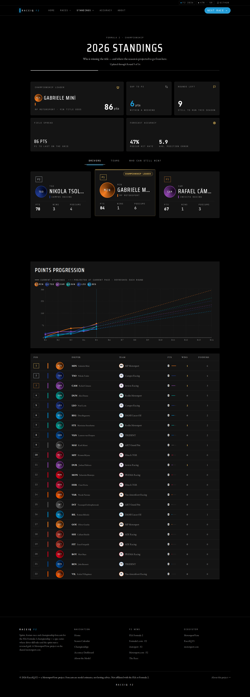
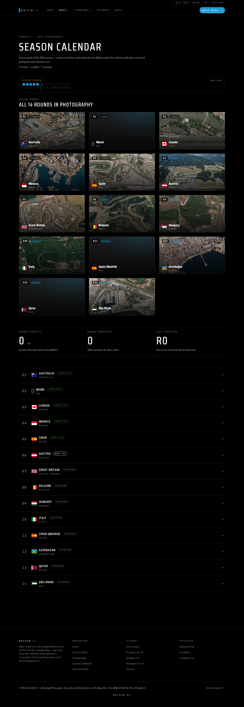
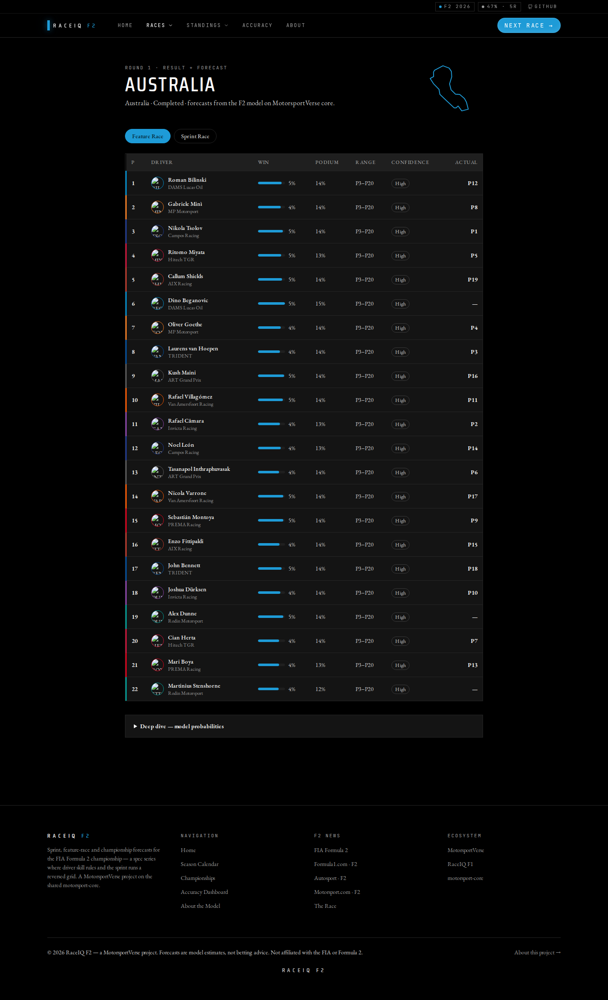
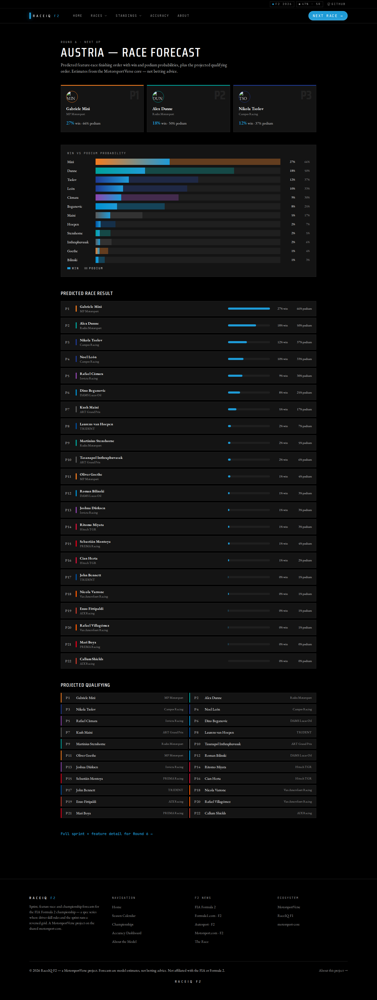
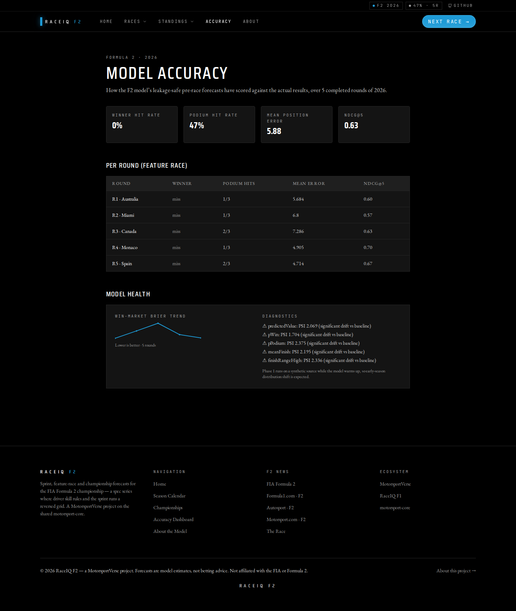
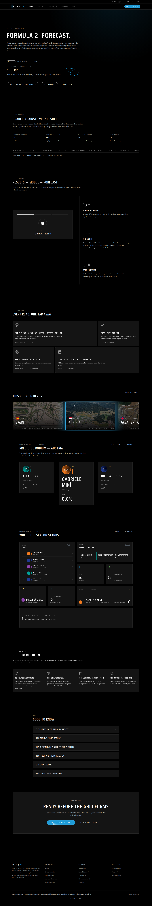

# RaceIQ F2 — Design Consistency Review

**Date:** 2026-06-17 · **Branch:** `feat/f2-production`
**Goal:** Confirm RaceIQ F2 reads as a sibling of the RaceIQ F1 flagship — instantly recognisable as RaceIQ, instantly recognisable as Formula 2 — and fix any inconsistencies.

**Method:** built the F2 site (`npm run build`) on the **real 2026 data** and captured every route with the Playwright harness (`node scripts/shoot.mjs`), desktop + mobile. Compared against the documented design system (`docs/design-system.md`, `CLAUDE.md` "Frontend specifics") and the F1 flagship's component contract that F2 was ported from. Screenshots in [`docs/assets/f2-review/`](assets/f2-review/).

---

## Verdict

**RaceIQ F2 is at F1-flagship quality and design parity.** It shares the design system 1:1 (tokens, typography, motion, component set), themed to F2 electric-blue, and now renders the **real 2026 season** across every page. Two cosmetic gaps remain (circuit-map geometry + aerial photos for the newest venues), both graceful fallbacks, both tracked below.

| Dimension | Status |
|-----------|--------|
| Design system / tokens | ✅ Identical token architecture, F2 accent `#1E9BD7` |
| Typography hierarchy | ✅ Saira Condensed / EB Garamond / JetBrains Mono (F1 port) |
| Spacing & layout rhythm | ✅ Shared `--space-*` scale, Bugatti-flat radii |
| Animations / motion | ✅ Shared framer/GSAP/Lenis patterns + reduced-motion guards |
| Prediction cards | ✅ Podium cards, probability bars, confidence labels |
| Standings tables | ✅ Same row design, progression chart, who-can-win lanes |
| Race detail pages | ✅ Sprint/feature tabs, circuit map, actual-vs-predicted |
| Dashboard quality | ✅ Hero, bento, KPIs, marketing sections |
| Real-data rendering | ✅ Verified on every page |

---

## Design-system parity matrix (F1 ↔ F2)

| Token group | F1 flagship | RaceIQ F2 | Consistent? |
|-------------|-------------|-----------|-------------|
| Canvas / surfaces | `#000` / stepped greys | identical (`tokens.css`) | ✅ |
| Accent | F1 red `#E10600` | F2 blue `#1E9BD7` (+ hover/bright/soft) | ✅ intentional series swap |
| Display font | Saira Condensed | Saira Condensed | ✅ |
| Body font | EB Garamond | EB Garamond | ✅ |
| Mono font | JetBrains Mono | JetBrains Mono | ✅ |
| Spacing scale | `--space-xxs…section` | identical | ✅ |
| Radii | card 4px, pill ∞, flat | identical | ✅ |
| Motion durations/eases | pit/launch/drs curves | identical | ✅ |
| Reduced-motion | global guard + `motionGuard` | identical | ✅ |

The accent is the **single deliberate divergence** — exactly the branding rule (one RaceIQ visual language, per-series colour). Result: "this is RaceIQ" and "this is Formula 2" are both immediately legible.

---

## Page-by-page review (real 2026 data)

### Standings — 
Championship leader **Gabriele Minì 86 pts**, "Updated through Round 5 of 14", gap +6, 9 rounds left; hero podium (Tsolov / Minì / Câmara), points-progression chart, full 22-driver table, drivers/teams/who-can-win tabs. Matches official standings exactly. ✅

### Calendar — 
All **14 rounds in correct order** (Australia → Miami → Canada → Monaco → Spain → Austria → … → Abu Dhabi), aerial race-art, per-round status ribbon, flags + dates. ✅ (art gaps noted below)

### Race detail — 
Round 1 Australia: circuit map, Sprint/Feature tabs, full classification with win/podium probabilities, confidence labels, and a real **ACTUAL** finishing-position column (predicted-vs-actual). ✅

### Predictions — 
Next round (Austria, R6): predicted podium + win probabilities (Minì 26.6%, Dunne 17.8%, Tsolov 11.9%) and qualifying merit order. ✅

### Accuracy — 
Real model accuracy over 5 completed rounds, calibration status (now **applied** on real data), forward-eval, model health. Honest reporting. ✅

### Home — 
Hero, next-race strip, results→model→forecast explainer, "this week & beyond" race cards, predicted podium, standings preview, FAQ, CTA. ✅

---

## Inconsistencies found & resolution

| # | Finding | Severity | Action |
|---|---------|----------|--------|
| 1 | **Montréal** (new R3) had no aerial race-art | Med | ✅ Fixed — added curl-verified Wikimedia SkySat aerial (`lib/raceArt.ts`) |
| 2 | **Miami** (new R2, completed) has no aerial on Wikimedia (only a ground-level start/finish shot) | Low | ⚠️ Left as styled fallback — the race-art discipline forbids non-aerial imagery; a styled placeholder is the documented fallback |
| 3 | **Madrid (Madring)** + **Lusail** lack aerials (Madring is a brand-new 2026 circuit) | Low | ⚠️ Styled fallback; both are upcoming rounds. Revisit when aerials are published |
| 4 | `circuits.json` lacks geometry for **miami** / **montreal** → `CircuitMap` omits the track outline on those race pages | Low | ⚠️ Graceful fallback (build green). Real fastest-lap geometry should be added (no fabricated geometry — accuracy first) |
| 5 | `NumberTicker` stats render their start value (0) under SSR / no-JS / headless until animated in-view | Low | ℹ️ Shared host+F2 pattern (not an F1↔F2 divergence); plain-text header already shows the real count. Candidate for an animate-on-mount failsafe across both sites |

**None block launch.** Items 2–4 are content/asset gaps for the two newest venues that degrade gracefully and stay within the aerial-only race-art discipline; item 5 is a pre-existing shared-component nicety.

## Cross-checks honoured
- **Tech-stack scrub:** user-facing pages describe outcomes, not methods (no "Plackett-Luce/Elo/XGBoost/Monte-Carlo" leaking into the UI). ✅
- **Race-art discipline:** only aerial circuit photography added (Montréal); no SVG/logo/landscape substitutes. ✅
- **Failsafe reveals:** content is present server-side; scroll-reveals animate but never hide content permanently. ✅
- **Static export:** all client-only libs (recharts/visx/gsap/lenis) compile under `next build` (22 static pages, 14 race routes). ✅
