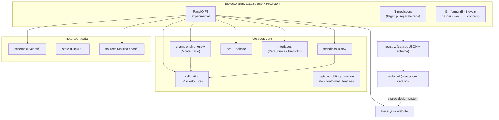

# Implementation summary — platform expansion

This phase took MotorsportVerse from an ecosystem *foundation* to a real
*multi-project platform*: a coherent brand system, the first fully-operational
expansion beyond F1 (RaceIQ F2), repository hygiene fixes, and two new pieces of
reusable core infrastructure. **F1 production code was not touched.**

## What shipped

### A. Branding & ecosystem identity
- One generator — [`scripts/generate_brand.py`](../scripts/generate_brand.py) —
  emits the entire **RaceIQ** logo system: per-series marks + lockups + the
  MotorsportVerse ecosystem logo + OG card (23 SVGs).
- Shared design language across all series (geometric wordmark, telemetry-tick
  motif, forward speed-chevron), unique accent per series.
- [`docs/BRANDING_SYSTEM.md`](BRANDING_SYSTEM.md) documents the architecture;
  the ecosystem logo is placed in the root README.

### B. RaceIQ F2 — first operational expansion
- Scaffold → product: calendar ingestion, driver/team standings, qualifying +
  race prediction, championship Monte Carlo, and a 4-page website.
- **~74% of the pipeline and ~77% of the website are reused** shared
  infrastructure. Full detail in [F2_READINESS.md](F2_READINESS.md).
- Building it surfaced two cross-series capabilities, added to the **core** (not
  F2): `motorsport_core.standings` and `motorsport_core.championship`.

### C. Repository hygiene
- Fixed a silent `.gitignore` risk (unanchored `data/` shadowing committed
  catalog JSON), deduped `brier_score`, fixed a `motorsport-data` `__all__`
  mismatch. Full report: [REPO_AUDIT.md](REPO_AUDIT.md).

### D. Git workflow
- Work committed in four logical groups: **branding**, **f2-implementation**,
  **documentation**, **cleanup** (see `git log`).

## Architecture (updated)



★ = added this phase.

## Data flow (RaceIQ F2)

```
config (roster, calendar, points, latent pace)
      │
      ▼
F2DataSource ──(results, leakage-safe)──► pipeline.estimate_pace
      │                                          │
      ├─ driver/team standings ◄─ core.standings │
      │                                          ▼
      │                          core.calibration (Plackett-Luce)
      │                                          │
      │                          ┌───────────────┼────────────────┐
      ▼                          ▼               ▼                ▼
  core.championship        quali order      race order      win/podium probs
  (Monte Carlo title)            │               │                │
      │                          └──────┬────────┴────────────────┘
      ▼                                 ▼
  export.py ───────────────► website/public/data/f2.json ──► RaceIQ F2 website
```

## Verification

- **All tests pass**: 96 core (incl. 10 new standings/championship) + data + 18
  F2 = **106 passed, 1 skipped**; `ruff check` clean.
- **Both websites build**: ecosystem (17 static pages) and RaceIQ F2 (5 pages).
- **F1 untouched**: nothing written under `/home/ronaltshuler/code/f1_predictions`.

## Deliverables index

| Report | File |
|---|---|
| Implementation summary + architecture diagram | this file |
| F2 readiness report | [F2_READINESS.md](F2_READINESS.md) |
| Branding report / system | [BRANDING_SYSTEM.md](BRANDING_SYSTEM.md) |
| Repository audit | [REPO_AUDIT.md](REPO_AUDIT.md) |
| Architecture reference | [architecture.md](architecture.md) |
