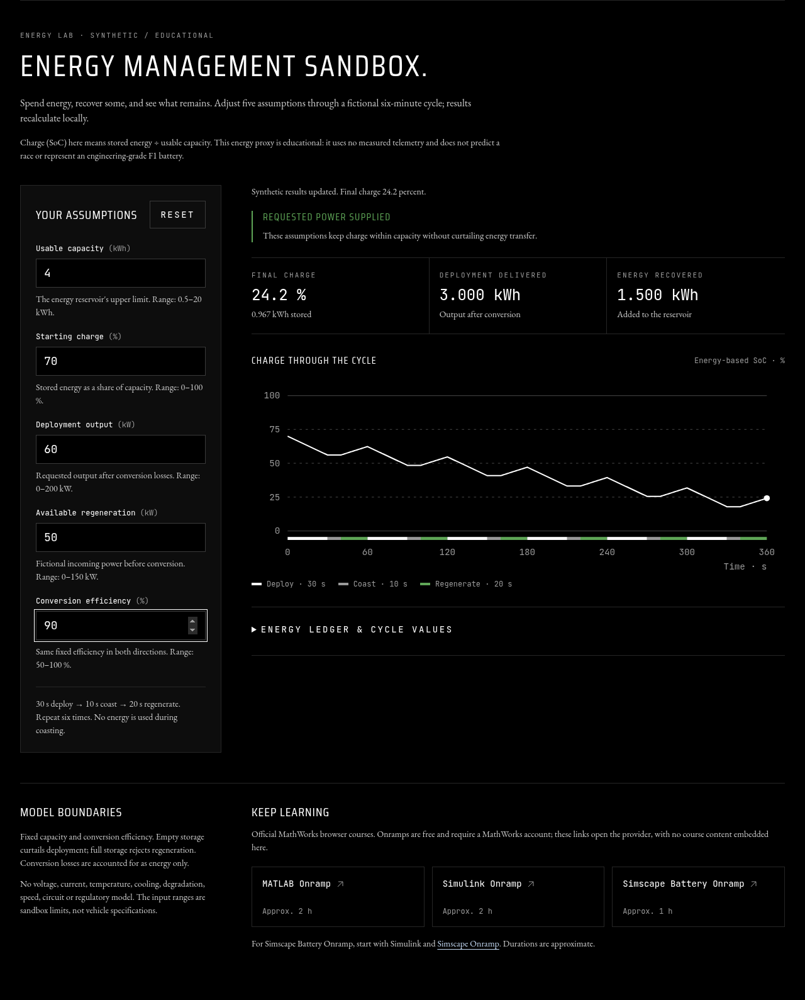
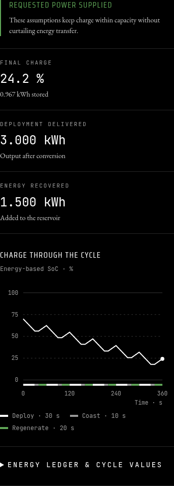

# Next.js frontend maintenance — 2026-10-09

The hub and all ten series frontends move from Next.js / eslint-config-next
16.1.6 to **16.3.8**. This is an update within Next 16, across minor releases.
It targets the verified Next advisories without a framework rewrite or UI change.
The base is merged PR17 (`5ec3ee2c303e6b8e1b169c4662f0b416733a0ae6`).
Existing cloud recovery worktrees and branches remain preserved; laptop-only
weekend navigation has not been transferred or represented as included.

## Advisory and compatibility

The [official Next advisory](https://github.com/advisories/GHSA-cjq9-62q9-8jv4)
marks Next >=16.0.0 and <16.3.8 affected by image-optimization SSRF.
[Next's 16.3.8 release](https://github.com/vercel/next.js/releases/tag/v16.3.8)
includes the fix. All eleven repository configurations use `output: "export"`
and `images.unoptimized: true`. F1 additionally declares two remote image hosts.
These configuration facts do **not** establish an exposed deployed server image
optimizer, exploitation, or an incident; this is preventive dependency maintenance.

The [registry metadata](next-registry-metadata.json) requires Node >=20.9.0 and
supports the existing React 19 versions. Validation uses Node **20.20.2** and npm
**10.9.9**, with each site's existing `legacy-peer-deps=true` policy.
Matching [ESLint configuration metadata](eslint-registry-metadata.json) supports
ESLint >=9 and TypeScript >=3.3.1. React/react-dom remain **19.2.3** and
source-map-js remains **1.2.2**. No other direct dependency specification changes.

Required resolutions include Next's SWC/env packages, PostCSS **8.5.23**, Sharp
**0.35.5** and its native packages. Next's baseline-browser-mapping dependency is
refreshed within its declared `^2.9.19` range to **2.11.28**. Its
[official advisory](https://github.com/advisories/GHSA-w5vr-8v7q-w6rv) identifies
2.11.0 as patched. [Lock deltas and hashes](lock-deltas.json) enumerate every
version change, addition and removal. Original lock key order is retained to
avoid unrelated reorder noise; no forced audit fix or package major downgrade
is used.

## Detailed audit snapshots

The raw registry responses are retained for every site, before and after:
[`audits/before`](audits/before/) and [`audits/final`](audits/final/).
Each stage has `*-full.json`, `*-production.json` and a summary containing the
locked file hash, exact command and exit code. Commands are `npm audit --json`
and `npm audit --json --omit=dev`. Full-audit exit 1 denotes recorded findings;
these are successful audit queries, not clean full-audit results.

| Site | Full findings before → after | Critical/high before → after | Production-only findings before → after |
| --- | --- | --- | --- |
| hub | 16 → 12 | 1/11 → 0/9 | 5 → 0 |
| f1 | 21 → 16 | 1/13 → 0/10 | 5 → 0 |
| f2 | 32 → 28 | 1/11 → 0/9 | 5 → 0 |
| f3 | 16 → 12 | 1/11 → 0/9 | 5 → 0 |
| formula-e | 32 → 28 | 1/11 → 0/9 | 5 → 0 |
| indycar | 31 → 26 | 1/11 → 0/8 | 5 → 0 |
| nascar | 32 → 28 | 1/11 → 0/9 | 5 → 0 |
| motogp | 28 → 25 | 1/9 → 0/7 | 3 → 0 |
| wec | 28 → 25 | 1/9 → 0/7 | 3 → 0 |
| imsa | 28 → 25 | 1/9 → 0/7 | 3 → 0 |
| wrc | 28 → 25 | 1/9 → 0/7 | 3 → 0 |

All eleven final production-only responses report **zero findings** at this
snapshot. This describes the npm audit dependency inventory, not an assertion
that deployed application code is vulnerability-free. Full audits still report
12–28 development/tooling findings per site. The Next, Sharp and Next-owned
PostCSS findings are removed. A separate development PostCSS resolution remains
in some Tailwind trees; Babel, Jest, parsers, globbing and lint dependencies also
remain in the full reports.

The ESLint chain still reaches `fast-glob → micromatch → braces`. The
[braces advisory](https://github.com/advisories/GHSA-vfj7-8cjw-p6xm) currently
lists no patched version. npm's suggested eslint-config-next 14.2.35 and Jest 25
major downgrades are not suitable fixes for this bounded Next 16 maintenance.
Remaining full findings are follow-up work, not silently marked resolved.

## Hydration diagnostic compatibility

The initial F1 run had **254 passing / 2 failing** tests because it expected a
controlled matching-markup replay to fail when the private child boundary was
removed. Running the exact same RootLayout and RouteMain source against the old
and new bundled renderers proves the behavioral difference in production and
development: [raw probes](hydration-probes/).

| Controlled fixture | Next 16.1.6 | Next 16.3.8 |
| --- | --- | --- |
| Matching markup, current child boundary | No error; main/content reused | No error; main/content reused |
| Matching markup, boundary removed only in compiled diagnostic | Hydration error; nodes replaced | No error; main/content reused |
| Genuine server-text mismatch | Hydration error; content replaced | Hydration error; content replaced |

The updated test explicitly requires the new matching-node behavior and retains
the genuine mismatch check in both renderer modes. The application boundary,
markup, styles, branding, circuit workspace, local capture and energy exercise
are unchanged. [Preservation evidence](preservation.json) records 2,807 tracked
source/data/model/config files: 2,806 byte-identical and the single documented
diagnostic test change. No generated source data or model artifacts are committed.

## Verification

All **55 local checks pass**: clean `npm ci`, lint, Jest, TypeScript and a full
production build for each of the eleven frontends. The builds use the actual
Pages base paths (`/motorsportverse`, then `/projects/<series>`) and run prebuilds.
F1 produces 85 static pages, including OG generation and PNG-to-WebP conversion
with updated Sharp. [Machine-readable counts](verification-summary.json) and
[per-command logs](checks/) record **2,256 tests passed, eight skipped**, and
**29 lint warnings / zero errors**. The hub's eight existing shared-data tests
are skipped because it publishes a registry rather than series probability,
season-summary or evidence files. No validation gate is newly disabled. Saved text logs have only trailing
whitespace/EOF blank lines normalized for Git; [original and saved hashes](log-normalization.json)
record this formatting change. JSON audit/console records retain their contents.

Checks run on a disposable full source snapshot, with the exact
[manifest/lock hashes](check-inputs.json). Native installs and generated registry,
OG and visualization outputs remain outside the saved source worktree; source
assets and data are preserved. The initial F1 diagnostic failure is retained in
[its original log](initial-f1-test-failure.log); the final corrected test suite
has 256 passing tests. No final local check failed or production build was skipped.

Chromium **151.0.7922.173** exercises actual production exports locally. The
original repository QA scripts are retained, with an additional read-only
[console/request monitor](console-monitor.mjs); [runner hashes](qa-runner-hashes.json)
identify the code used. This verification does not claim a public deployment.

- [Energy exercise](browser-energy/browser-qa.json): four desktop/mobile and
  normal/reduced-motion journeys, race → circuit navigation, inputs/reset,
  invalid-result hiding, bounds/ledger, chart responsiveness, local capture and
  reload. All four pass.
- [Freshness states](browser-freshness/browser-qa.json): 32 journeys covering
  stored actual data and explicitly labelled missing/conflicting/invalid metadata
  and unavailable-file fixtures. All pass.
- [Hydration routes](browser-hydration/summary.json): four actual race → circuit
  transitions, both motion preferences, desktop/mobile, and normal/120ms delayed
  scripts. No injected DOM mismatch; zero hydration/page errors.

Raw console/request records are retained with each report. Only exact intercepted
external image URLs with the matching browser network-abort message are expected
resource errors. Freshness's four 404s belong to its explicit missing-file fixture.
The additional monitor records **15 initial chart sizing warnings** in the
freshness scenarios; these are not hydration/page errors and are not hidden.

The [all-site navigation run](browser-sites/journey-qa.json) passes four variants
across **all eleven sites** (40 series journeys), desktop/mobile, light/dark and
both motion preferences. It covers hub search/launch, calendars, standings and
profiles, F1 lap archive selection/loading/error/empty states, local capture
loading/cancellation/invalid input, fallback screens, keyboard focus, palette
contrast and document overflow. It records zero page errors and zero unexpected
HTTP failures under the runner's explicit fixture/portrait exceptions.

The [supplemental console classification](browser-sites/classification.json)
retains **128 chart sizing warnings** and **24 SVG attribute errors** on WEC/IMSA
progression charts. A [bounded saved Next 16.1.6 baseline run](browser-baseline/)
reproduces the same SVG error on all six corresponding routes. That bounded
baseline run did not exercise the chart-warning routes or record chart warnings.
The [SVG source hashes](browser-sites/svg-source-comparison.json)
are identical; no rendering/data source is changed. The SVG errors are
pre-existing. A [separate chart-route baseline](browser-chart-baseline/)
reproduces **18** chart sizing warnings on the saved Next 16.1.6 F2/F3/Formula
E/NASCAR journeys. The category also predates this patch; warning frequency is
not claimed equal across different route sets/viewports. F1's warning frequency
was not directly compared with its prior build. This report does not describe
the console as clean.

The run also records **201 unique missing portrait paths**. The
[file inventory](browser-sites/missing-portrait-inventory.json) verifies each is
absent in both the saved baseline and updated source/export trees. The 1,300
404 console messages include repeated portrait requests and explicit missing-page
fixtures; four 503s are deliberate lap-archive fixtures. All external provider
requests are intercepted, with exact URL/message matching in the console record.
Cancelled local navigation/prefetch requests are retained as well. No additional
console message category or page error remains unclassified.

Exact-head CI links are recorded in the draft PR after the feature branch is
pushed. Ordinary CI skips F1's build by existing policy; the full local F1 build
above supplies that check. No production deployment is dispatched.

Selected genuine screenshots:

| Desktop circuit exercise | Mobile circuit chart |
| --- | --- |
|  |  |

[Freshness journey](browser-freshness/desktop-actual-journey.png) ·
[Conflicting metadata fixture](browser-freshness/desktop-source-conflict.png) ·
[Archived lap comparison](browser-sites/desktop-light-lap.png) ·
[Mobile hub](browser-sites/mobile-light-hub-home.png) ·
[Mobile MotoGP profile](browser-sites/mobile-light-motogp-profile.png)

Reproduce the existing browser scripts from a source snapshot with the rebuilt
exports and F1/hub dependencies installed. For additional observability, launch
Node with `--import /path/to/console-monitor.mjs`, run with the repository root as
working directory, and set `NEXT_MAINTENANCE_CONSOLE_LOG` to the destination JSON.
The exact script arguments are:

```sh
node scripts/qa_theme_journeys.mjs <output>/sites final
node scripts/qa/energy_sandbox.mjs projects/f1-predictions/website/out <output>/energy
node scripts/qa/prediction_freshness.mjs projects/f1-predictions/website/out <output>/freshness
node scripts/qa/hydration_routes.mjs projects/f1-predictions/website/out <output>/hydration 4
```

No provider traffic, new credentials, deployment or production dispatch is needed.
