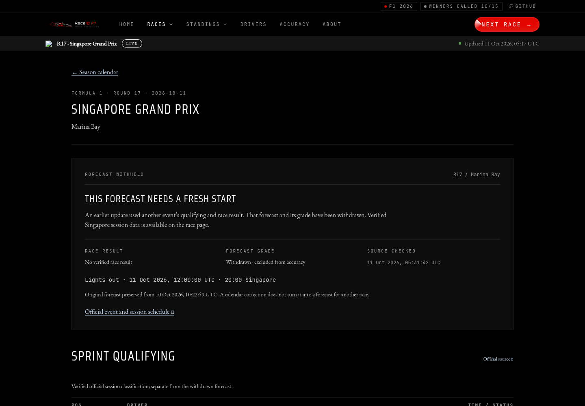

# F1 event identity repair

This proposed change is held for independent review. It does not establish that
the live site has been updated. No production prediction job was dispatched.

The calendar omitted an inserted event. Its round 16 said Singapore, while the
providers' round 16 was the Bahrain Grand Prix in Malaysia at Sepang. On
10 October, FastF1 resolved Singapore to round 17 and was rejected; the fallback
accepted a round-16 Jolpica response without checking the event name, date or
circuit. The export then attached Sepang's classification to Singapore, marked
Singapore complete and published a forecast grade before the Singapore race.
The [incident job](https://github.com/roni-altshuler/motorsportverse/actions/runs/38044616774/job/114191521060)
and [selected log lines](incident-excerpt.txt) show the mismatch. The incident
commit is `48042c34c272fe92d1da94ada29f62f793a80ed6`; this branch starts from
`14d86df32ad7c3345873e780dfe6fac0f38e18d1`.

## What was verified

Free primary sources were checked on 11 October 2026, before the race:

- [Formula1.com calendar](https://www.formula1.com/en/racing/2026): 23 events;
  Sepang-hosted Bahrain is round 16 on 4 October, Singapore is round 17 on
  11 October, and later events move one round forward.
- [Singapore schedule](https://www.formula1.com/en/racing/2026/singapore): the
  race starts at 12:00 UTC / 20:00 Singapore. Official qualifying starts at
  13:30 UTC on 10 October; Jolpica's calendar says 13:00, so that conflicting
  qualifying time was not promoted into the publication.
- [Sepang classification](https://www.formula1.com/en/results/2026/races/1308/bahrain/race-result):
  the full finishing order matches the wrongly attached result. Its displayed
  race classification is independently verified. Scheduled laps and recorded
  completed laps are separate; this repair does not infer a new strategy model.
- Singapore's [Sprint Qualifying](https://www.formula1.com/en/results/2026/races/1296/singapore/sprint-qualifying),
  [Sprint](https://www.formula1.com/en/results/2026/races/1296/singapore/sprint-results),
  [qualifying](https://www.formula1.com/en/results/2026/races/1296/singapore/qualifying)
  and [starting grid](https://www.formula1.com/en/results/2026/races/1296/singapore/starting-grid)
  each contain 22 driver records. Russell is sixth in qualifying and 21st on
  the post-penalty grid. These are distinct session facts, not refreshed model
  inputs. No Singapore Grand Prix result is claimed at the review time.
- The bounded [Jolpica season calendar](https://api.jolpi.ca/ergast/f1/2026.json)
  and [FastF1 maintainer schedule](https://raw.githubusercontent.com/theOehrly/f1schedule/master/schedule_2026.json)
  corroborate event identities. Saved factual extracts are
  [provider-calendar-2026.json](provider-calendar-2026.json),
  [fastf1-calendar-identities.json](fastf1-calendar-identities.json) and
  [verified-sessions.json](verified-sessions.json). Explicit provider aliases
  cover different official names/localities and Las Vegas's UTC/local dates.

The saved cloud proxy rejected direct Jolpica result/session requests with
CONNECT 403; its event results were not independently verified through that
endpoint. Formula1.com's bounded official session pages supplied the factual
classifications. No provider-wide scrape, paid source or new credential was used.

## Repair and provenance

The guards require season/round, name, date and circuit for Jolpica, and round,
name, local date and location for FastF1. A stored snapshot with an incompatible
calendar identity makes `needs_update` return true even if it already contains
actual results. Post-race grading refuses that incompatible snapshot. A
`post-race` phase label alone cannot count as a completed race.

The review reproduced an additional preservation defect: post-qualifying export
stamped the new identity before copying the old event's actuals, grade, tracker,
enrichment and geometry. Export now refuses that state before entering the
pipeline or overwriting its file. Preservation and tracker rehydration require
an existing snapshot with a matching identity. Committed qualifying overrides
check both the stored event and any explicit session identity before using the
trusted override. Replay sessions are verified before loading telemetry; bounded
historical layout fallbacks require the same venue and their season's verified
provider schedule identity.

Singapore's withdrawal also blocks automatic preview/post-qualifying exports
before any pipeline work. It remains outstanding in freshness detection, rather
than becoming an apparently final verified freeze. No scheduled caller can
release it. The separate `publication_release` API requires an explicit audit
note, review time, exact official session snapshot digest and current Python model
source digest. Generation must use the reviewed qualifying times and complete
post-penalty grid, including Russell at 21st; a model that still uses his
qualifying rank of sixth is rejected. A successful future release must finish
before 12:00 UTC, records its new generation time and model configuration digest,
and retains the original withdrawn forecast provenance separately. The digest
pins implementation source, not fitted model weights or an accuracy claim.
The release tests use synthetic generation fixtures; no replacement forecast or
model training was run. Official session tables remain available during the hold.

The original round-16 Singapore forecast is archived with its unchanged
`2026-10-10T10:22:59Z` timestamp and byte digest. It is not relabelled as a
pre-Sepang forecast. Future previews move by matching event identity; their
classification values and original timestamps remain unchanged, with original
round numbers and digests recorded. Their embedded obsolete tracker snapshots
are removed. Previews do not establish a verified pre-race input cutoff.

[The quarantine manifest](../../../archive/event-identity-2026-10-11/manifest.json)
records original JSON digests and the compressed asset digest. The JSON archive
preserves the original forecast, trackers, calendars, probabilities and derived
diagnostics. The asset archive preserves the affected model files and original
visualizations. The contaminated round-16 model is removed from the serving
registry. Archives are review material and are not published forecast inputs.
The old-calendar future registry records 17–22 contain metadata only and name
the next events (for example, record 17 names the United States). Those records
are also preserved and withdrawn, so none remains under Singapore's new round.

Round 16 now has a verified Sepang result with an explicitly absent forecast.
Round 17 has official Singapore session tables, a withheld ranking and no grade.
Empty probability withdrawal records keep coverage gaps visible while the
client treats them as unavailable. The graded record contains rounds 1–15;
official-result coverage contains 16 rounds, and usable stored ranking coverage
contains 21 snapshots, including future previews. Championship projections and
drift diagnostics are withheld pending review. Sakhir strategy priors and
imagery are not presented as Sepang facts, and the false 2026 Singapore winner
is removed from circuit history.

The original user interface adds a quiet publication notice, separate result
and grade state, source-check time, immutable original forecast time, official
outbound links and responsive session tables. It uses the existing black,
hairline and typography system; no Formula1.com assets or layout were copied.

## Verification

The regression tests reproduce the same-round, wrong-event fallback, missing
identity fields, provider aliases, no-work false negative, false completion,
withdrawal of grades/probabilities and preservation of original forecasts.
[The reproduction record](recurrence-reproductions.json) identifies the failing
baseline cases and their saved log digests.
Additional regressions cover the post-qualifying preservation defect, trusted
qualifying override, replay/layout guards, durable automatic holds, changed
reviewed inputs, ignored grid penalties and the pre-race release deadline.
Frontend tests verify the withheld state, Russell's distinct session positions
and the relocated venue's imagery gap. The published-data integrity gate and
shared UI synchronization are checked without allowances.

Browser verification uses the production static export at its real Pages prefix
`/motorsportverse/projects/f1`, served locally in Chromium. The reference clock
is fixed before the race. [The browser report](browser-qa.json) records routes,
widths, overflow, runtime errors, failed requests, source links and keyboard
navigation. Screenshots show the home notice and both repaired race pages.
This is local exported-site QA, not a hosted deployment claim.

Local validation: **1,153 Python tests passed, 15 skipped**; **268 frontend
tests passed**. Ruff, TypeScript, the Pages-prefix static build, all 50 published
data integrity checks and shared UI synchronization passed. ESLint has no errors
and retains one existing warning in `AccuracyDashboardPage.tsx`.

The browser audit covers 18 route/width combinations and three keyboard
navigation checks at 1440, 390 and 320 pixels, with reduced motion. No page
overflow, runtime error or local request failure was observed. The saved cloud
proxy blocks external FlagCDN and Wikimedia requests with
`ERR_TUNNEL_CONNECTION_FAILED` (109 observed requests), so existing remote flags
and photography were unavailable. Local driver portraits and the new notice,
tables, source links and navigation were checked. This limitation is recorded
in the browser report and visible in the screenshots.

[Singapore mobile page](singapore-390.png) ·
[Sepang result](sepang-1440.png) ·
[Home publication notice](home-publication-390.png)

## Remaining model audit

No model algorithm was changed, retrained or promoted. Existing probability
diagnostics use a shared temperature tuned across requested scored rounds even
though each logistic calibrator is prior-only; their labels now disclose that
they are retrospective, rather than claiming a fully out-of-sample record.
Driver-by-track history wiring, post-qualifying weather/penalty refresh and an
independent chronological Ridge challenger remain separate work. No accuracy
gain is claimed. The unpublished laptop navigation branch was not transferred
or overwritten; other saved-cloud worktrees remain separate.
